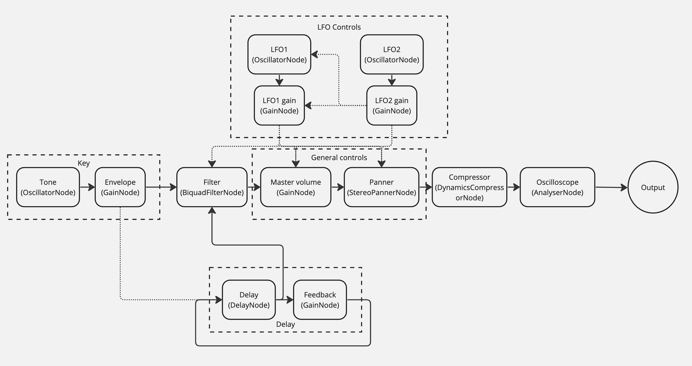

# Noise Maker! 🎹💥


A web synthesizer built on top of [Web Audio API](https://developer.mozilla.org/en-US/docs/Web/API/Web_Audio_API), [React](https://react.dev/) and [WebMIDI.js](https://webmidijs.org/)

**[Try it out!](https://guillermoparral1995.github.io/noise-maker/)**

## Installation and local setup

```
# Install dependencies
npm install

# Start up app in http://localhost:5173
npm run dev

# Run unit tests
npm run test:dev
```

## Features and usage
### MIDI support
This synthesizer was intended to be used with a MIDI Controller. Currently all MIDI mappings for controls are hardcoded to fit an Arturia MiniLab MkII (a cool contribution to make would be to have these mappings customisable! 😉).

### PWA
You can download _Noise Maker_ into your mobile device as an app since it's a [PWA](https://developer.mozilla.org/en-US/docs/Web/Progressive_web_apps)! The mobile version of the app shows all controls under the settings section.

### Keyboard support
You can hit the keys with your mouse (or tap them in mobile), or you can use your keyboard! Lowest key starts at the <kbd>Q</kbd> key.

### Nodes and associated controls


#### Filter
This is a [BiquadFilterNode](https://developer.mozilla.org/en-US/docs/Web/API/BiquadFilterNode) for which type, cutoff and resonance are adjustable. Type can be either high-pass or low-pass.

#### Volume
This is a [GainNode](https://developer.mozilla.org/en-US/docs/Web/API/GainNode), controls general output volume.

#### Pan
This is a [StereoPannerNode](https://developer.mozilla.org/en-US/docs/Web/API/StereoPannerNode), controls general output panning.

#### Compressor
This is a [DynamicsCompressorNode](https://developer.mozilla.org/en-US/docs/Web/API/DynamicsCompressorNode), for which attack, release, knee, ratio and threshold are adjustable.

#### Analyser
This is an [AnalyserNode](https://developer.mozilla.org/es/docs/Web/API/AnalyserNode), used to render the oscilloscope component.

#### LFOs
This synthesizer has 2 LFOs, each consisting of an [OscillatorNode](https://developer.mozilla.org/en-US/docs/Web/API/OscillatorNode) connected to a [GainNode](https://developer.mozilla.org/en-US/docs/Web/API/GainNode). Adjustable parameters are:
- waveform and frequency of the OscillatorNode
- gain of the GainNode
- targets: filter cutoff, filter resonance, volume, pan, key detune and LFO1 amplitude and frequency (in the case of LFO2)

#### Delay
This synthesizer comes with a delay effect, built with a [DelayNode](https://developer.mozilla.org/en-US/docs/Web/API/DelayNode) connected to a [GainNode](https://developer.mozilla.org/en-US/docs/Web/API/GainNode) for feedback control. Delay time and feedback gain are both adjustable. Also there's a trails switch that controls whether the delay output remains connected after delay is turned off or not.

#### Keys
Each key in the keyboard consists of an [OscillatorNode](https://developer.mozilla.org/en-US/docs/Web/API/OscillatorNode) connected to a [GainNode](https://developer.mozilla.org/en-US/docs/Web/API/GainNode). Each key has a fixed frequency (because of the assigned note), but oscillator's waveform and detune properties are adjustable. The waveform and detune controls affect all keys at once

### State management
This project uses React's native hooks for state management by using state reducer pattern. All Web Audio API nodes are instantiated once on app startup and only control values are stored in state. State is lifted up only to the lowest level possible to reach affected components instead of keeping it at root level: this decision is made in order to avoid re-rendering controls that are not related to the control that's being changed.

## Contributing
All contributions, comments and issues are encouraged and more than welcome! Feel free to throw in a [pull request](https://github.com/guillermoparral1995/noise-maker/pulls) or create a new [issue](https://github.com/guillermoparral1995/noise-maker/issues)!